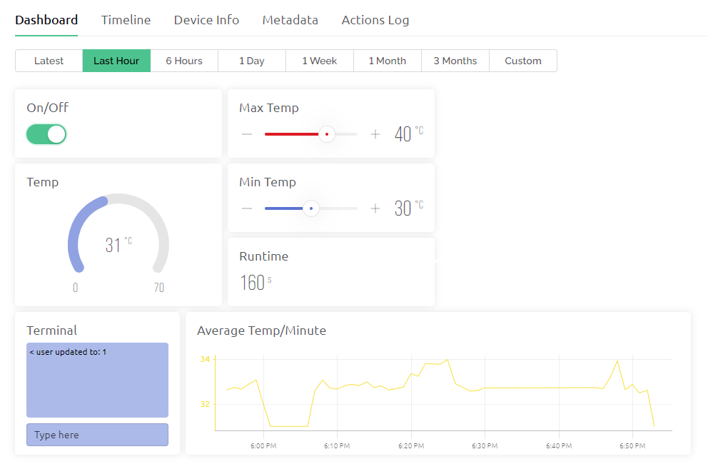
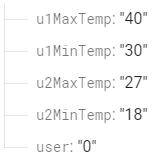

# IoT-Project
Project I've made for the Internet of Things Lesson

Technologies used are Blynk and Firebase.
Haardware used is NodeMCU with the ESP8266 chip.

## Blynk Dashboard
- Max Temp and Min Temp sliders are used to change the maximum temperature and minimum temperature respectively
- Terminal is used to change the user

## Firebase
- Changes made in the Blynk Dashboard is reflected in their related variables 

